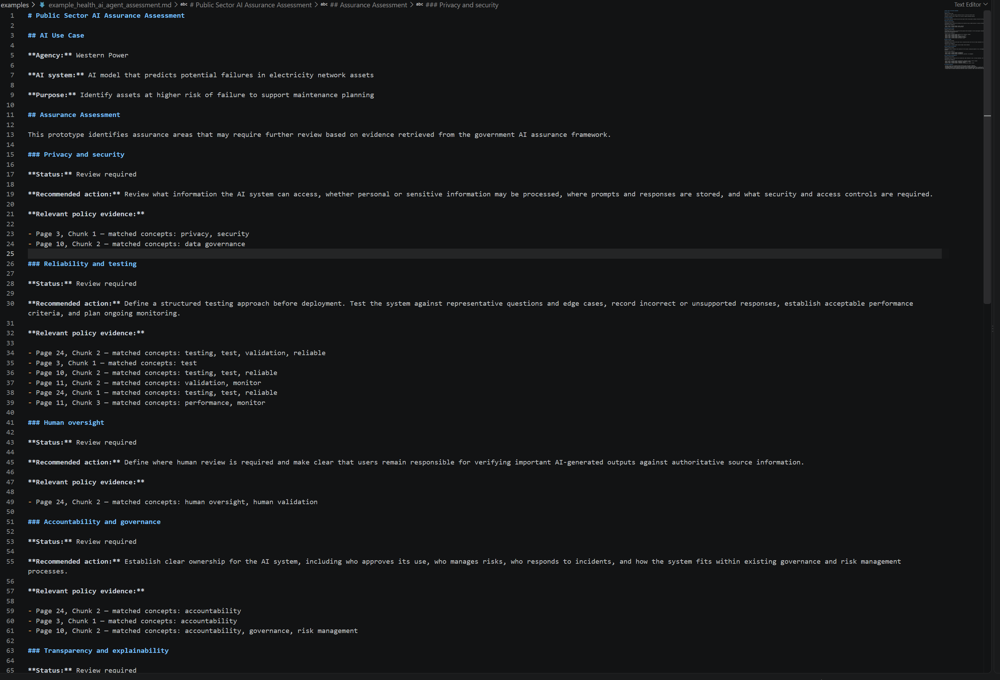

# Public Sector AI Evaluation Lab

A lightweight prototype for exploring how public-sector AI use cases can be assessed against government AI assurance guidance.

The project takes a proposed AI use case, identifies potentially relevant assurance areas, retrieves supporting evidence from the **National Framework for the Assurance of Artificial Intelligence in Government**, and produces a structured assessment report with practical next actions and source references.

 

## Why I Built This

AI teams working across government may encounter very different problems across agencies.

One engagement might involve evaluating an AI model, another may involve governance or documentation, while another may involve supporting the deployment or testing of an AI solution.

I built this prototype to explore a practical question:

> How could a technical team quickly perform an initial, transparent assessment of an unfamiliar public-sector AI use case while keeping the findings traceable to published government guidance?

Rather than attempting to automate an assurance decision, the prototype acts as an initial decision-support tool. It highlights areas that may require further investigation and preserves the evidence used in the assessment.

## What the Prototype Does

The user provides:

- agency or organisation
- AI system or solution
- purpose of the AI system
- data used by the system
- known concerns or risks

The prototype then:

1. loads the government AI assurance framework
2. cleans the extracted PDF text
3. splits the document into overlapping chunks while preserving page metadata
4. identifies assurance areas relevant to the supplied use case
5. retrieves potentially relevant sections of the framework
6. associates retrieved evidence with assurance areas
7. provides predefined practical next actions
8. generates a Markdown assessment report with source page references

## Current Assurance Areas

V1 considers five areas:

- Privacy and security
- Reliability and testing
- Human oversight
- Accountability and governance
- Transparency and explainability

The prototype distinguishes between:

- **Review required** — the use case triggered the assurance area and supporting policy evidence was retrieved.
- **Relevant - evidence not retrieved** — the use case triggered the assurance area, but the current retrieval method did not find supporting evidence.
- **Not triggered by supplied use case** — no indicators for the assurance area were identified from the information supplied.

These statuses are intended to support further investigation. They are not compliance or deployment decisions.

## Architecture

```text
Government AI Assurance Framework (PDF)
                |
                v
        Document extraction
                |
                v
           Text cleaning
                |
                v
     Page-aware text chunking
                |
                +----------------------+
                                       |
User-supplied AI use case              |
        |                              |
        v                              |
Identify relevant assurance areas      |
        |                              |
        +------------------------------+
                       |
                       v
              Policy retrieval
                       |
                       v
           Evidence classification
                       |
                       v
          Structured assessment
                       |
                       v
          Markdown report output
```

## Project Structure

```text
public-sector-ai-evaluation-lab/
|
|-- data/
|   `-- government AI assurance framework
|
|-- outputs/
|   `-- generated assessment reports
|
|-- src/
|   |-- clean_text.py
|   |-- load_document.py
|   |-- chunk_document.py
|   |-- retrieve.py
|   |-- evaluate_use_case.py
|   |-- assess_use_case.py
|   |-- generate_report.py
|   `-- run_assessment.py
|
|-- tests/
|-- requirements.txt
`-- README.md
```

## Running the Prototype

Create and activate a Python virtual environment and install the required dependencies.

```bash
pip install -r requirements.txt
```

Run:

```bash
python src/run_assessment.py
```

The prototype will prompt for information about the AI use case.

Example:

```text
Agency or organisation:
Western Power

AI system or solution:
AI model that predicts potential failures in electricity network assets

Purpose of the AI system:
Identify assets at higher risk of failure to support maintenance planning

Data used by the AI system:
Historical asset condition, maintenance and failure data

Known concerns or risks:
reliability safety accuracy testing monitoring explainability accountability
```

A Markdown assessment is then generated in the `outputs` directory.

## Testing and Iteration

I deliberately started with simple, transparent logic so I could inspect how each stage of the pipeline behaved before introducing more complex AI components.

During development, I tested the prototype against contrasting scenarios.

### Health AI agent

A fictional health-sector use case involved a generative AI agent answering staff questions from internal clinical and operational policy documents.

This scenario raised considerations including privacy, security, reliability, human oversight and accountability.

### Infrastructure predictive AI

A second scenario considered an AI model predicting potential electricity-network asset failures.

This tested whether the same assessment pipeline could be applied to a substantially different domain and AI capability without changing the underlying code.

### Public-document summarisation

A lower-risk scenario considered an AI tool summarising publicly available government reports, with accuracy supplied as the primary concern.

Testing this scenario exposed an important limitation in the initial design: assurance categories were being inferred primarily from retrieved policy text.

This meant an explicitly supplied concern such as `accuracy` could be missed if the initial keyword retrieval did not return a reliability-related policy section.

I therefore separated:

1. **identification of assurance areas from the characteristics of the use case**, and
2. **retrieval of policy evidence supporting those areas**.

This improved the transparency of the assessment and allowed the prototype to distinguish between an area that was not triggered and an area that was relevant but lacked retrieved evidence.

## Design Decisions

### Traceability

Page and chunk metadata are retained throughout the pipeline so assessment findings can be traced back to their source material.

### Transparent V1 logic

V1 deliberately uses rule-based category identification and keyword retrieval.

This makes the behaviour easy to inspect, test and explain while providing a baseline for evaluating more sophisticated approaches.

### Human review

The prototype does not make automated approval, compliance or deployment decisions.

A failure to retrieve evidence is also not interpreted as evidence that no risk exists.

## Current Limitations

This is an exploratory prototype rather than a production assurance system.

Current limitations include:

- assurance categories are identified using predefined rule-based indicators
- retrieval uses keyword matching rather than semantic search
- relevant policy material may be missed where terminology differs
- retrieved chunks may be only partially relevant
- recommendations are predefined rather than generated dynamically
- the current prototype uses one primary assurance framework
- no automated technical testing of an actual AI model or agent is performed
- no production deployment or authentication layer is included

Outputs should therefore be treated as prompts for further investigation rather than authoritative assurance findings.

## Future Development

Potential next iterations include:

- semantic retrieval using embeddings
- vector-based document search
- support for multiple government policies and technical standards
- LLM-assisted analysis grounded in retrieved evidence
- automated evaluation of AI-agent responses
- configurable assurance frameworks
- improved source citation
- automated test suites
- containerisation using Docker
- deployment into a cloud or controlled environment
- a lightweight web interface

## Technology

Current V1:

- Python
- pypdf
- regular expressions
- rule-based classification
- keyword retrieval
- Markdown report generation

The architecture is intentionally modular so individual components can be replaced as the prototype evolves.

For example, keyword retrieval could later be replaced with semantic embeddings without redesigning the document-ingestion or reporting components.

## Status

**V1 — functional prototype**

The current version can accept different public-sector AI scenarios, identify relevant assurance considerations, retrieve supporting government guidance and generate a structured assessment report.

The project is intended as a learning and experimentation environment for public-sector AI evaluation, assurance and responsible implementation.